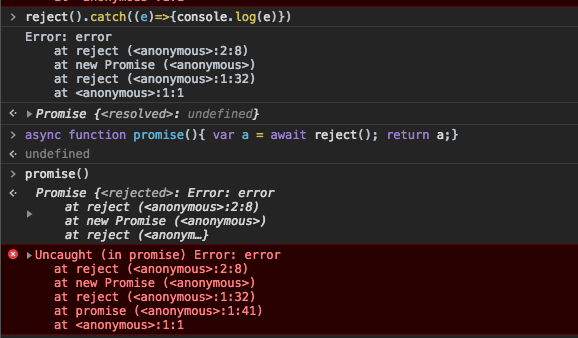

## async函数

 什么是async函数？
 >最直接的一点说明就是async修饰的函数它的返回值是 Promise对象。
 
 ```js
 async function test(){
    return "async func"
 }
 test()// Promise：{resolve：()=>{}}
 
```

   `那么await是又是什么作用呢？`
   
```js

 async function test(){
    
    const file= await readFile('/var/webpack.config.js');
    
    console.log(file.toString())
 }
 
 test() // 输出的是文件内容
 
```

  
```js

// await js实现 
function sync(promise){
    return function() {
    var self = this,
      args = arguments;
    // 将返回值promise化
    return new Promise(function(resolve, reject) {
      // 获取迭代器实例
      var gen = fn.apply(self, args);
      // 执行下一步
      function _next(value) {
        asyncGeneratorStep(gen, resolve, reject, _next, _throw, 'next', value);
      }
      // 抛出异常
      function _throw(err) {
        asyncGeneratorStep(gen, resolve, reject, _next, _throw, 'throw', err);
      }
      // 第一次触发
      _next(undefined);
    });
  };
}

function asyncGeneratorStep(gen, resolve, reject, _next, _throw, key, arg) {
  try {
    var info = gen[key](arg);
    var value = info.value;
  } catch (error) {
    reject(error);
    return;
  }
  if (info.done) {
    // 迭代器完成，将返回值（return）保存起来
    resolve(value);
  } else {
    // -- 这行代码就是精髓 --
    // 将所有值promise化
    // 比如 yield 1
    // const a = Promise.resolve(1) a 是一个 promise
    // const b = Promise.resolve(a) b 是一个 promise
    // 可以做到统一 promise 输出
    // 当 promise 执行完之后再执行下一步
    // 递归调用 next 函数，直到 done == true
    Promise.resolve(value).then(_next, _throw);
  }
}


 
```


跟原来的差别在哪里呢？就是readFile实际上一个异步方法，但是在我们用了await修饰符之后，我们就不需要用一步的形式传入回调函数来获取到数据。而是变为一个同步的表达式。await 实际上的效果就是程序在刺入等待后面表达式完成知道返回值。

##优点

 1.我觉得最大的有点就是比*和yield语言清晰太多了，书写的时候清晰明了。
 2.js有了异步方法同步执行这一点后，代码形式上会比以前清晰简化。
 
 注意！如果await后面可能返回reject那么最好做好 `try...catch`,否则会影响代码的同步执行
 
 
